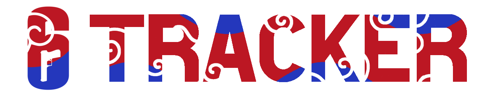

	 
	Kally 
		(they/them) 
	
		Lead Developer @ <a
		href="https://store.avengetech.net"
		style="
			font-weight: bold;
			font-size: 12px;
			text-decoration: none;
			color: inherit;
		"
		>AvengeTech Network</a
	>

	<h3 style="font-weight: bold; font-size: 20px;">About Me</h3>

&nbsp;&nbsp;&nbsp;&nbsp;Hey there, I'm Kally! I'm 19 years old, and I'm a self-taught programmer and software engineer currently working on my certification in Computer Programming! I like to dabble in everything from simple web APIs to building standalone applications from the ground up. I've been programming for almost 9 years, or since I was roughly 11 years old, and I've grown to love the creative freedom the art brings me. I've spent countless hours writing silly little programs for me and my friends to use, and even taught some of them how to code! 

 

	<h3 style="font-weight: bold; font-size: 20px;">My Projects</h3>

&nbsp;&nbsp;&nbsp;&nbsp;I'm always bouncing around to different projects! Whether it's a Discord bot, desktop application, or even a Minecraft server, I never stay still. I have ADHD, so I'm always working on multiple projects at once. Here are a few of them that I'm doing right now: 

	
	
	
	

